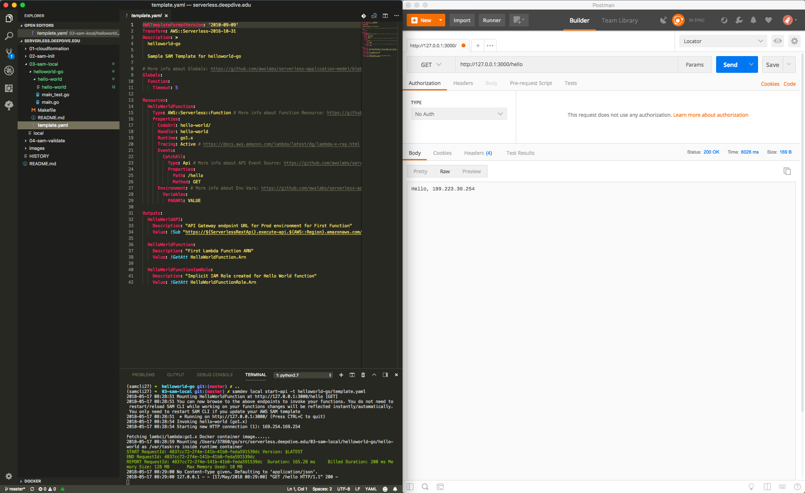
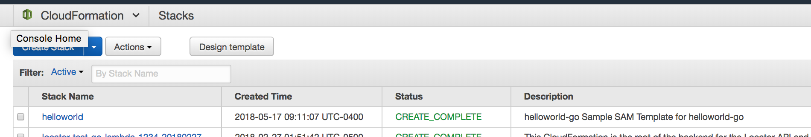
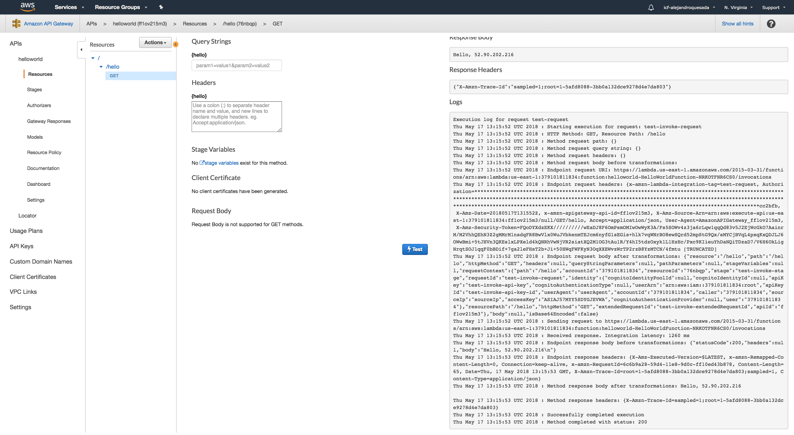

# An Introduction to Serverless Applications
*By Alejandro Quesada*

- [An Introduction to Serverless Applications](#an-introduction-to-serverless-applications)
    - [Goal](#goal)
    - [Requirements](#requirements)
    - [Agenda](#agenda)
    - [What is FaaS?](#what-is-faas)
    - [Why use FaaS?](#why-use-faas)
    - [AWS Lambda Limitations](#aws-lambda-limitations)
    - [Infrastructure as Code with CloudFormation](#infrastructure-as-code-with-cloudformation)
    - [What is SAM?](#what-is-sam)
    - [SAM Commands](#sam-commands)
        - [`init`](#init)
        - [`validate`](#validate)
        - [`package`](#package)
        - [`local`](#local)
        - [`deploy`](#deploy)
    - [APP: Hello World(s) APIs](#app--hello-worlds-apis)
    - [APP: Todo List PWA / API](#app--todo-list-pwa---api)
    - [The Definitive Maxim of 05/17/18](#the-definitive-maxim-of-05-17-18)
    - [Other Notable Serverless Options](#other-notable-serverless-options)
    - [Resources](#resources)

## Goal
Demonstrate high value per unit effort inherent to serverless applications as it pertains to:
- pay as you go
- infrastructure as code
- recouped maintanence overhead
- enough automation to make Tesla jealous (everything is a CLI command)

We will accomplish the aforementioned via the classic "Hello World" and "Todo List" applications.

## Requirements
- Basic AWS Knowledge
- Basic Cloud Knowledge
- Understand the concept of servers
- Tool: Docker [https://www.docker.com/](https://www.docker.com/)
- Tool: awscli [https://aws.amazon.com/cli/](https://aws.amazon.com/cli/)
- Tool: sam [https://github.com/awslabs/serverless-application-model](https://github.com/awslabs/serverless-application-model)

## Agenda
- What is FaaS?
- Why use FaaS?
- AWS Lambda Limitations
- Lambda and API Gateway 
- Infrastructure as Code with CloudFormation
- What is SAM? 
- SAM Commands
- APP: Hello World(s) APIs
- APP: Todo List PWA / API
- The Definitive Maxim of 05/17/18
- Other Notable Serverless 
- Alternative Products

## What is FaaS?

From Wikipedia:

> Function as a service (FaaS) is a category of cloud computing services that provides a platform allowing customers to develop, run, and manage application functionalities without the complexity of building and maintaining the infrastructure typically associated with developing and launching an app [1]. Building an application following this model is one way of achieving a "serverless" architecture, and is typically used when building microservices applications.

> FaaS is an extremely recent development in cloud computing, first made available to the world by hook.io in October 2014,[2] followed by AWS Lambda,[3] Google Cloud Functions, Microsoft Azure Functions, IBM/Apache's OpenWhisk (open source) in 2016 and Oracle Cloud Fn (open source) in 2017 which are available for public use. FaaS capabilities also exist in private platforms, as demonstrated by Uber's Schemaless triggers[4].

## Why use FaaS? 

While FaaS maintains a slim class of its own complexities (see AWS Lambda limitations below), it allows for a focus on code and less on maintaining infastructure (including OS patches, etc). Strategies for cycling servers and load balancing take a step back to API versioning strategies (which is no simpler in typical infrastructure) and the limitations below. 

FaaS deltas Platform as a Service (PaaS) in that the latter requires always requires a running thread - even if it handles load balancing. FaaS, starting with AWS Lambda, are "on-demand" and metered per subsecond use. PaaS is closer to a more typical server setup, however it is hosted by a compensated entity. 

Utilizing FaaS recoups costs via pay-as-you-go, reduced server maintanence, 'infinite' horizontal scaling and configurable vertical scaling. 

Use cases: [https://aws.amazon.com/lambda/](https://aws.amazon.com/lambda/)

We will be focusing on AWS Lambda from here on out.

Lambda supports an array of languages including: 
- NodeJS
- Python
- Java 8
- C#
- Go

## AWS Lambda Limitations

[https://docs.aws.amazon.com/lambda/latest/dg/limits.html](https://docs.aws.amazon.com/lambda/latest/dg/limits.html)

tl;dr: 
- AWS Lambda Account Limits per Region 
    - Concurrent Executions: 1000 (default limit - can be increased)
- AWS Lambda Resource Limits per Invocation
    - Maximum duration execution time: 300s or 5min
    - Memory allocation range: min 128MB / max 3008MB with 64MB increments
    - `/tmp` space for writing is limited to 512MB
    - Deployment package size (compressed .zip/.jar file): 50MB

Lambdas lives and works in shared infrastructure somewhere. When a function is first called it is suseptible to an infamous **cold start**. To picture, when a user first calls your Java Lambda, your Java Lambda must warm up the JVM and then compute results for the requestee. Of course this results in atypical long request times. This occurs somewhat unpredictably (typically happening in the first few calls after a long gap in calls where it silently warms down). User behavior can be nonlinear, therefore concurrent executions of a Lambda in a pre-loaded state can cause multiple cold starts affecting numerous users response delivery times. There are strategies for this such as: keeping your function warm (with analytics you can determine best times to do so, etc: [https://hackernoon.com/im-afraid-you-re-thinking-about-aws-lambda-cold-starts-all-wrong-7d907f278a4f](https://hackernoon.com/im-afraid-you-re-thinking-about-aws-lambda-cold-starts-all-wrong-7d907f278a4f)). Considering Lambda's freetier allows for a one million free invocations, anything smaller than a midtier application should not be overly aversely affected by redundant calls to their service. FaaS in general are probably not a great solution if you require guarenteed razor sharp performance and are therefore latency intolerant, but then again you would not be using a garbage collected language either.  

## Infrastructure as Code with CloudFormation

As far as I know, most of what you need to accomplish via infrastructure can be executed in AWS CloudFormation (with the exception of ACM Certification and I am sure other things Andy S could corret me on). CloudFormation (CF) is used under the hood for Elastic Beanstalk and other services Andy S could likely correctly reference. CF declares infrastructure to AWS and AWS produces it to specification. It can be either in YAML or JSON. 

An example CloudFormation project is found in `01-cloudformation`.

*It is assumed you have the AWS CLI and have produced a S3 bucket to stash CF templates into*

Snippets and example templates:
- [https://docs.aws.amazon.com/AWSCloudFormation/latest/UserGuide/CHAP_TemplateQuickRef.html](https://docs.aws.amazon.com/AWSCloudFormation/latest/UserGuide/CHAP_TemplateQuickRef.html)
- [https://docs.aws.amazon.com/AWSCloudFormation/latest/UserGuide/sample-templates-services-us-west-2.html](https://docs.aws.amazon.com/AWSCloudFormation/latest/UserGuide/sample-templates-services-us-west-2.html)

## What is SAM?

The Serverless Application Model (SAM) is a pre-processor to CF characterized by the following header: 

```yaml
AWSTemplateFormatVersion: '2010-09-09'
Transform: AWS::Serverless-2016-10-31
```

The AWS CLI's CloudFormation command requires a few steps to update a Lambda:
- Upload code zip an S3 location contracted within the CF YAML (must meet URL structure advertised); unless using `aws cloudformation package`. 
- Upload and run CF for any related updates. 

Native CF requires explicit versioning of a Lambda function (`latest`, etc). Some services such as CloudWatch assume `latest` version. <!-- thanks to Andy S -->

Why use SAM when we have CF? For serverless applications, to accomodate a single Lambda function for request you would need the following resources seperately declared and properly configured:
- AWS::IAM::Role
- AWS::Lambda::Function
- AWS::ApiGateway::Deployment
- AWS::ApiGateway::RestApi + any Swagger configuration necessary for a route
- Probably other things - these alone for RP are a few 1000 lines of YAML for ~10 services + some. 

In-contrast to the aforementioned in SAM:
```yaml
HelloWorldFunction:
    Type: AWS::Serverless::Function # More info about Function Resource: https://github.com/awslabs/serverless-application-model/blob/master/versions/2016-10-31.md#awsserverlessfunction
    Properties:
      CodeUri: hello-world/
      Handler: hello-world
      Runtime: go1.x
      Tracing: Active # https://docs.aws.amazon.com/lambda/latest/dg/lambda-x-ray.html
      Events:
        CatchAll:
          Type: Api # More info about API Event Source: https://github.com/awslabs/serverless-application-model/blob/master/versions/2016-10-31.md#api
          Properties:
            Path: /hello
            Method: GET
      Environment: # More info about Env Vars: https://github.com/awslabs/serverless-application-model/blob/master/versions/2016-10-31.md#environment-object
        Variables:
          PARAM1: VALUE
```

The previous YAML will handle ~85% of the aforementioned resources allocated. SAM will produce an API Gateway with the `/hello` route, a Lambda (code pointed to a local .zip) and optional event listeners / code deployment methods such as Canary, etc. 

There is quite a lot in this space. 



The following instructions come from a SAM Initted function:

```bash
aws s3 mb s3://BUCKET_NAME
```

Next, run the following command to package our Lambda function to S3:

```bash
sam package \
    --template-file template.yaml \
    --output-template-file packaged.yaml \
    --s3-bucket REPLACE_THIS_WITH_YOUR_S3_BUCKET_NAME
```

Next, the following command will create a Cloudformation Stack and deploy your SAM resources.

```bash
sam deploy \
    --template-file packaged.yaml \
    --stack-name helloworld-go \
    --capabilities CAPABILITY_IAM
```

> **See [Serverless Application Model (SAM) HOWTO Guide](https://github.com/awslabs/serverless-application-model/blob/master/HOWTO.md) for more details in how to get started.**

After deployment is complete you can run the following command to retrieve the API Gateway Endpoint URL:

```bash
aws cloudformation describe-stacks \
    --stack-name helloworld-go \
    --query 'Stacks[].Outputs'
``` 

End quote.

## SAM Commands

```text
  init      Initialize a serverless application with a...
  package   Package an AWS SAM application. This is an alias for 'aws
            cloudformation package'.
  local     Run your Serverless application locally for...
  validate  Validate an AWS SAM template.
  deploy    Deploy an AWS SAM application. This is an alias for 'aws
            cloudformation deploy'.
```

### `init`

> Initialize a serverless application with a SAM template, folder structure for your Lambda functions, connected to an event source such as APIs, S3 Buckets or DynamoDB Tables. This application includes everything you need to get started with serverless and eventually grow into a production scale application.
> This command can initialize a boilerplate serverless app. If you want to create your own template as well as use a custom location please take a look at our official documentation.

tl:dr; creates a boiler plate app with template.yaml, code and initial test framework. Can do so for the following languages:

```text
-r, --runtime [go1.x|nodejs|python|python2.7|python3.6|go|nodejs4.3|nodejs6.10|java8|dotnetcore1.0|java|dotnetcore2.0|dotnetcore|dotnet|nodejs8.10]
```


### `validate`

```sh
$ sam validate
template.yaml is a valid SAM Template
```

### `package`

```yaml
HelloWorldFunction:
    Type: AWS::Serverless::Function
    Properties:
      CodeUri: hello-world/
      Handler: hello-world
```

Point CodeUri to your codes .zip in your template.yaml. Provide an S3 location in the CLI and get a CF document with the .zip packaged, sent to S3 and then CodeUri replaced with its actual S3 URL. 

### `local`

Host your API in a Docker container locally, invoke an event by passing in JSON or generate an Event JSON from the following events: 

```txt
Commands:
  api       Generates a sample Amazon API Gateway event
  dynamodb  Generates a sample Amazon DynamoDB event
  kinesis   Generates a sample Amazon Kinesis event
  s3        Generates a sample Amazon S3 event
  schedule  Generates a sample scheduled event
  sns       Generates a sample Amazon SNS event
```

An example of event generation and then a test invokation: 

```txt
(samcli27) ➜  03-sam-local git:(master) ✗ samdev local generate-event api > request.json
(samcli27) ➜  03-sam-local git:(master) ✗ samdev local invoke -t helloworld-go/template.yaml -e request.json
2018-05-17 08:34:40 Invoking hello-world (go1.x)
2018-05-17 08:34:40 Starting new HTTP connection (1): 169.254.169.254

Fetching lambci/lambda:go1.x Docker container image......
2018-05-17 08:34:42 Mounting /Users/37860/go/src/serverless.deepdive.edu/03-sam-local/helloworld-go/hello-world as /var/task:ro inside runtime container
START RequestId: 73404a9b-0b03-1cb4-e466-7dafa04ce609 Version: $LATEST
{"statusCode":200,"headers":null,"body":"Hello, 199.223.30.254\n"}
END RequestId: 73404a9b-0b03-1cb4-e466-7dafa04ce609
REPORT RequestId: 73404a9b-0b03-1cb4-e466-7dafa04ce609  Duration: 201.28 ms     Billed Duration: 300 ms Memory Size: 128 MB       Max Memory Used: 10 MB
```

Take note of the 'Max Memory Used', 'Memory Size' and 'Duration' as they all relate to billing in the Cloud.

You can host the API in a local Docker container pictured below: 


*Note: be sure to include path such as `/hello` at end of `127.0.0.1:PORT` or else you will get an anonymous `403`*

If you require advanced local networking between services, you can declare your API into specific Docker networks.

If you require enviornmental variables, the option also exists via: `sam local start-api -t TEMPLATE -n env.json`

### `deploy`

Deploy your packaged function. Have a Hello World in less than five minutes. 

```sh
$ samdev deploy --template-file helloworld-go/build.output.yaml --stack-name helloworld --capabilities CAPABILITY_IAM --profile testaccount --region us-east-1
Waiting for changeset to be created..
Waiting for stack create/update to complete
Successfully created/updated stack - helloworld
```





## APP: Hello World(s) APIs

Head fake! We did this in `06-sam-deploy`.

## APP: Todo List PWA / API

I started this at 10:08AM on 05/17/18.

Checkout the directory `07-todo-list` for a complete:
- [ ] api
    - [x] launched
    - [ ] logic
    - [ ] qa
- [ ] front-end
    - [x] launched [http://xcvjalksdfjasieswebsite.s3-website.us-east-1.amazonaws.com/](http://xcvjalksdfjasieswebsite.s3-website.us-east-1.amazonaws.com/)
        - [x] s3
        - [ ] cloudfront <!-- [https://medium.com/all-technology-feeds/launching-a-static-site-with-react-aws-cloudfront-180f7a623675](https://medium.com/all-technology-feeds/launching-a-static-site-with-react-aws-cloudfront-180f7a623675) -->
    - [ ] scaffolded
    - [ ] logic

Known complications:
- SAM CLI is rather new, so there are a few issues. For this presentation I used a version built from source.
- Testing DynamoDB locally is challenging and not very representative of the actual production DynamoDB.
- Debugging and logging serverless is still peculiar (but getting better).

## The Definitive Maxim of 05/17/18

Everything is an event stream.

## Other Notable Serverless Options
- CloudFront and S3 website serving at pennies. Costs = (2.3 cents / month) * GB + Traffic per Andy S. First GB of transfer/month is free. 
- Lambda@Edge and CloudFront for webapp serving | compute @ edge locations
- Greengrass
- DynamoDB
- IoT
- etc.

## Resources
- [https://github.com/awslabs/serverless-application-model](https://github.com/awslabs/serverless-application-model)
- [https://aws.amazon.com/lambda/faqs/](https://aws.amazon.com/lambda/faqs/)
- [Terraform of Serverless](https://serverless.com/)